<h1 align="center">NONON</h1>

<p align="center"><strong>Finish everyday work with your own files, with AI that keeps working when the internet does not.</strong></p>

<p align="center">
  
  <a href="LICENSE"></a>
  
  
  
</p>

<p align="center">
  <a href="https://trynonon.xyz">Website</a> ·
  <a href="https://trynonon.xyz/download">Download</a> ·
  <a href="https://trynonon.xyz/status">What works today</a> ·
  <a href="docs/project/DELIVERY-LEDGER.md">Delivery ledger (honest status)</a> ·
  <a href="#testing-and-evidence">Evidence</a>
</p>

<p align="center"><em>A one-minute demo video has been prepared for the hackathon. It is not linked here yet: the link will be added when it is published.</em></p>

<p align="center">
  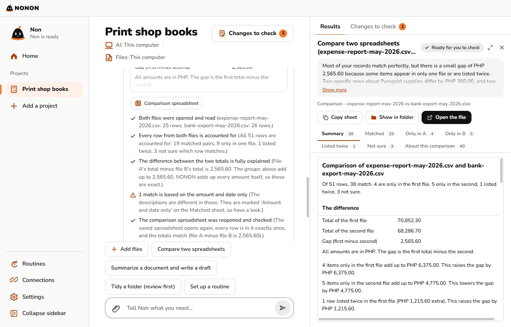
  <br><em>NONON comparing a bank export with an expense report: the answer, the checks and the sheets, all inside the app.</em>
</p>

## Contents

1. [What NONON is](#what-nonon-is)
2. [Why it exists](#why-it-exists) (includes [About this entry](#about-this-entry))
3. [See it in 60 seconds](#see-it-in-60-seconds)
4. [What it can do today](#what-it-can-do-today)
5. [You stay in charge](#you-stay-in-charge)
6. [Routines](#routines)
7. [Connections](#connections)
8. [Settings, Non and accessibility](#settings-non-and-accessibility)
9. [Install](#install)
10. [How it works](#how-it-works)
11. [Resource use and hardware](#resource-use-and-hardware)
12. [Privacy and security](#privacy-and-security)
13. [Testing and evidence](#testing-and-evidence)
14. [Known limits and what is not built](#known-limits-and-what-is-not-built)
15. [Run from source and package](#run-from-source-and-package)
16. [Repository layout](#repository-layout)
17. [Contributing and feedback](#contributing-and-feedback)
18. [Credits and licences](#credits-and-licences)

Who this page is for: if you are new to this, read sections 1 to 9. If you are judging the entry, sections 3, 5, 13 and 14 are the fastest path. If you are a developer, start at section 10.

---

## What NONON is

NONON is a desktop app for Windows and Mac. You give it a folder of your own files (spreadsheets, meeting notes, readings, letters) and tell it in plain words what you need. It does the job and shows you the result inside the app.

Three ideas hold it together:

1. **The AI runs on your computer.** NONON installs its own small AI (llama.cpp running a Qwen3.5 model). Your files are not sent anywhere for the jobs it does itself. After a one-time download of the AI (about 3 to 6 GB), those jobs work with the internet off.
2. **Ordinary code does the arithmetic and the checking.** The AI explains and drafts. Totals, matching and verification are done by normal programs, and the app shows the checks it ran.
3. **You approve every change.** NONON never edits one of your files until you press OK. Before it changes anything it saves a backup, so you can undo.

Optional extras you turn on yourself: an online AI you already use (Claude, Codex or Google Antigravity), Gmail for a daily email brief, and sharing the AI of one of your computers with another one on your home network.

Not sure what a word means? The app avoids jargon. "The AI on this computer" is the built-in AI. "A project" is one folder you let NONON work in.

---

## Why it exists

In Kyle's words:

> I believe everyone should have an easy way to get the kind of high-quality AI results that developers usually enjoy. I built NONON so anyone can have a free alternative to the rising cost of AI.

### About this entry

NONON is an entry for the **AppBuildersPH Hackathon**.

I believe everyone should have an easy way to get the kind of high-quality AI results that developers
usually enjoy. I built NONON so anyone can have a free alternative to the rising cost of AI. NONON is free to
use, and its built-in AI runs on your own computer, so everyday jobs cost nothing each time you use them and
keep working without the internet. If you choose to connect an online AI service such as Claude, Codex or
Antigravity, that service has its own prices, and NONON says so before it sends anything.

Status and honest limits: [`docs/project/DELIVERY-LEDGER.md`](docs/project/DELIVERY-LEDGER.md). Plan: [`docs/reference/NONON-PROJECT-PLAN.md`](docs/reference/NONON-PROJECT-PLAN.md). AI coding tools were used to build it: see [Credits and licences](#credits-and-licences).

---

## See it in 60 seconds

This is the path the demo video follows, using the sample files that ship with the app (an expense report and a bank export for May 2026). Setup happens once and is not part of the minute: the AI download takes a few minutes on a normal connection. On the development PC the answer itself took about 3 seconds.

### 1. Meet Non and set up

On first run, Non (your helper) welcomes you, asks what kind of work you want help with, and checks that the built-in AI is ready. If it is not installed yet, this step offers to download it. Before offering a download, NONON looks (read-only) for AI files you already have, in LM Studio, Ollama, the Hugging Face cache, your Downloads folder or NONON's own folder. If it finds one that works, you can use it where it is, with no copy and no second download. Only the small AI engine may still need downloading. A model NONON has not tested is labelled as such, and answers that fail NONON's number checks fall back to a plain labelled summary.

<p align="center">
  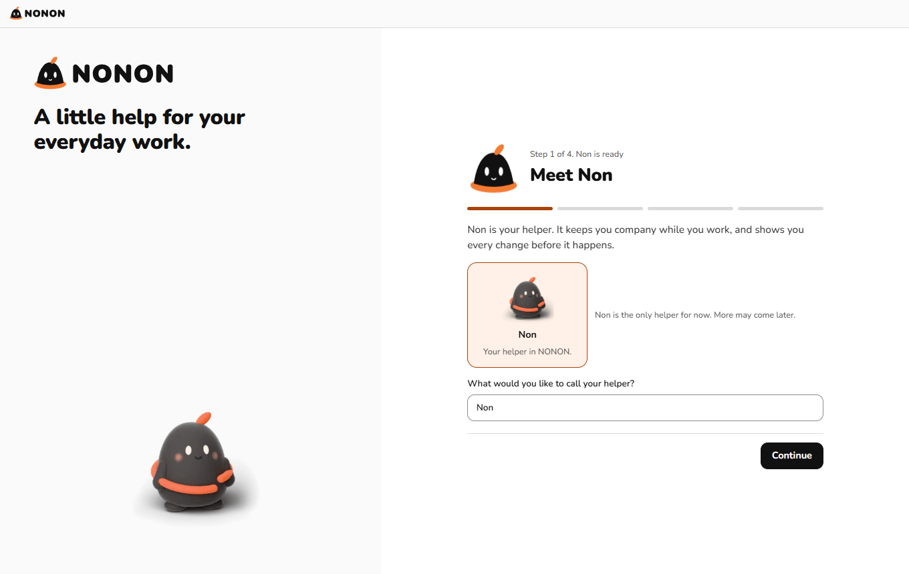
  <br><em>Step 1 of 4: meet Non. You can rename your helper.</em>
</p>

<p align="center">
  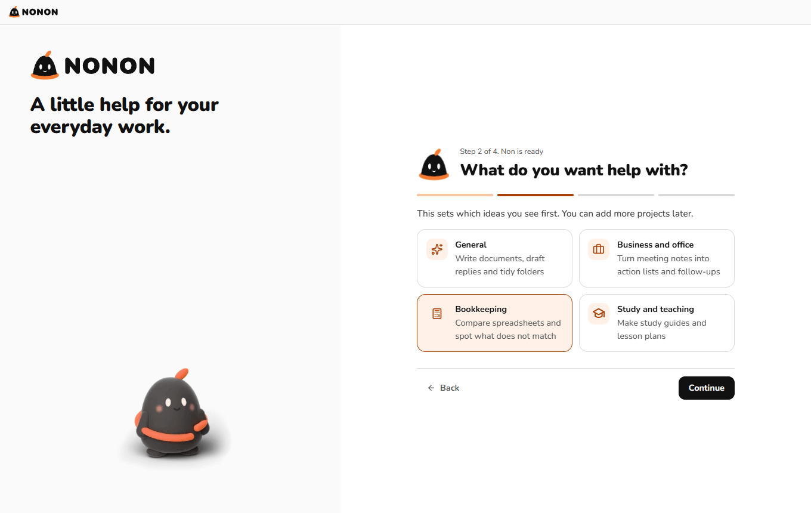
  <br><em>Step 2: choose a kind of work. This only decides which ideas you see first.</em>
</p>

<p align="center">
  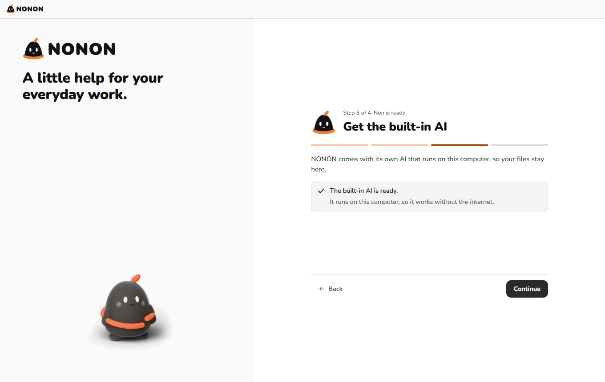
  <br><em>Step 3: the built-in AI is ready. It runs on this computer.</em>
</p>

### 2. Pick a folder

NONON only works inside a folder you choose. You can use your own folder or let it put sample files in an empty one. Everything it makes is saved in a folder called `NONON Output` inside your folder.

<p align="center">
  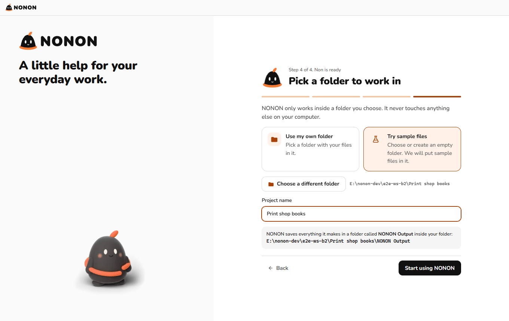
  <br><em>Step 4: pick a folder. "Try sample files" is the safest way to look around.</em>
</p>

The home screen then shows the ways to start. The small "i" on each card says what it works with and what to expect.

<p align="center">
  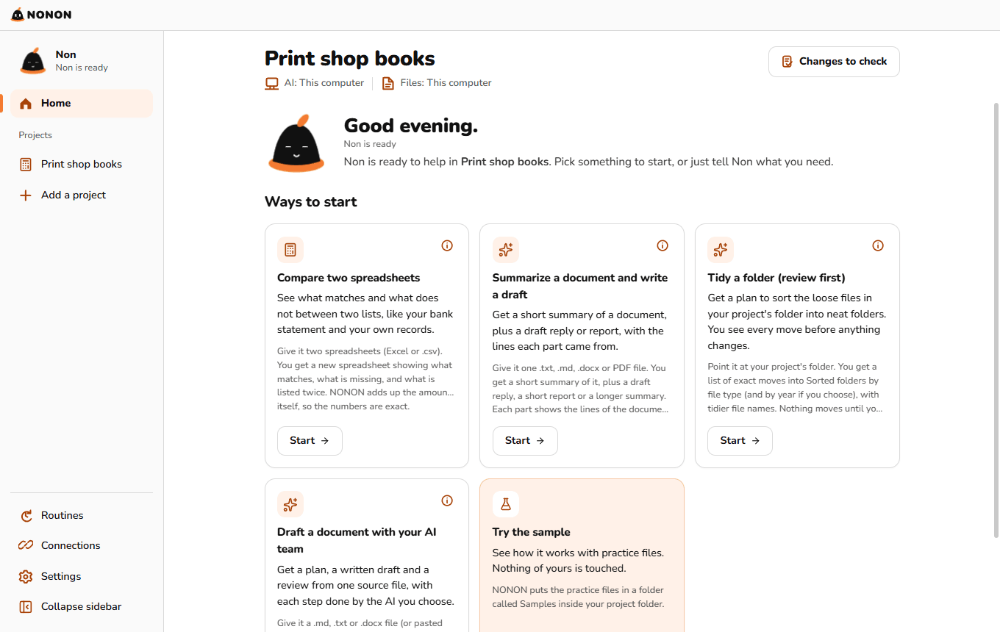
  <br><em>Home: five ways to start. The header always says where the AI and the files are: "AI: This computer", "Files: This computer".</em>
</p>

### 3. Ask in plain words

Click your project and type what you need. Name the files, or attach them with the paperclip. For the demo: `Compare expense-report-may-2026.csv with bank-export-may-2026.csv`. (A request that names no files, such as "compare my expense report", makes Non ask you to add the files first.)

<p align="center">
  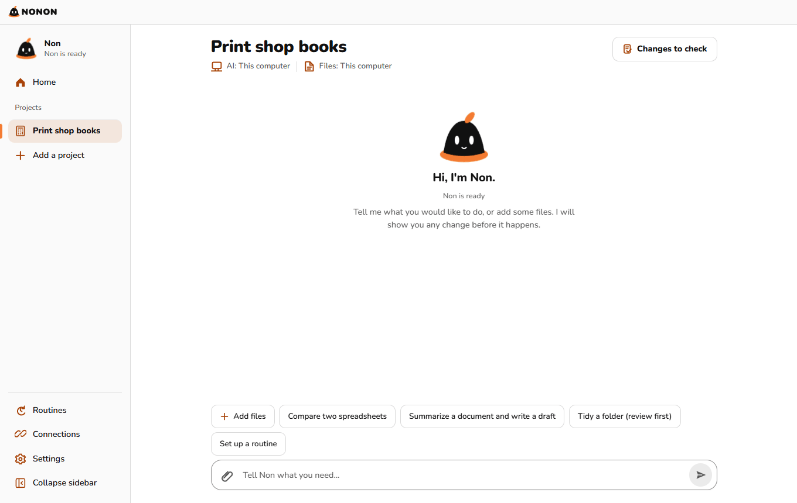
  <br><em>The conversation. Non shows any change before it happens.</em>
</p>

### 4. Answer a few quick questions

If NONON is unsure, it asks, in plain words, and puts a "Suggested" answer on each question. Here it asks whether plus and minus signs are flipped between a bank statement and an expense list, which dates to compare, and how close amounts and dates must be. Pressing Continue with the suggestions is fine. "Use this answer next time" remembers your choice.

<p align="center">
  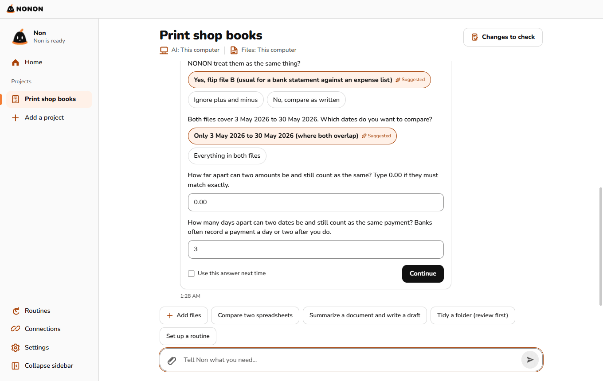
  <br><em>Questions come with suggested answers and a short reason.</em>
</p>

While it works, you see the steps and a Stop button.

<p align="center">
  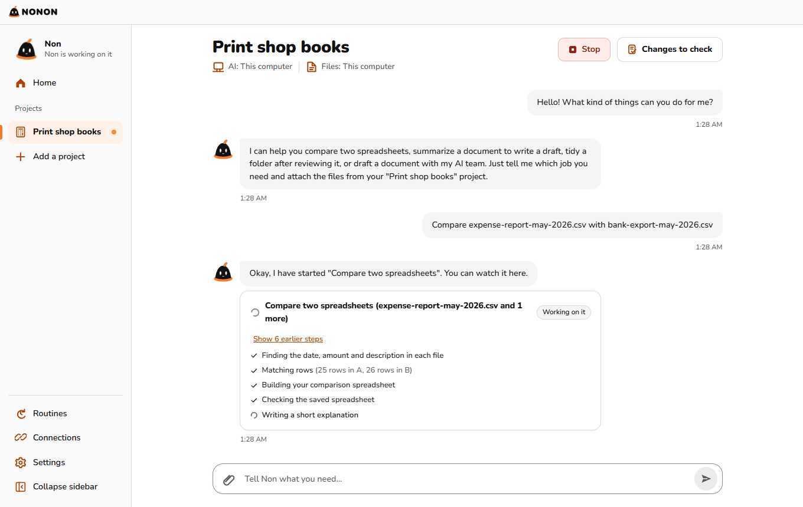
  <br><em>Working on it. Stop is always visible while a job runs.</em>
</p>

### 5. Read the result inside the app

The answer opens in a Results panel next to the chat. It starts with a one-page summary: both totals, the gap, where the gap comes from, and what to look at first. Every row of both files is accounted for.

<p align="center">
  
  <br><em>The Summary sheet. The numbers are added up by code and are exact to the cent.</em>
</p>

The comparison workbook has one sheet for each group of rows: Matched, Only in A, Only in B, Listed twice and Not sure, plus an "About this comparison" sheet with the rules used.

<p align="center">
  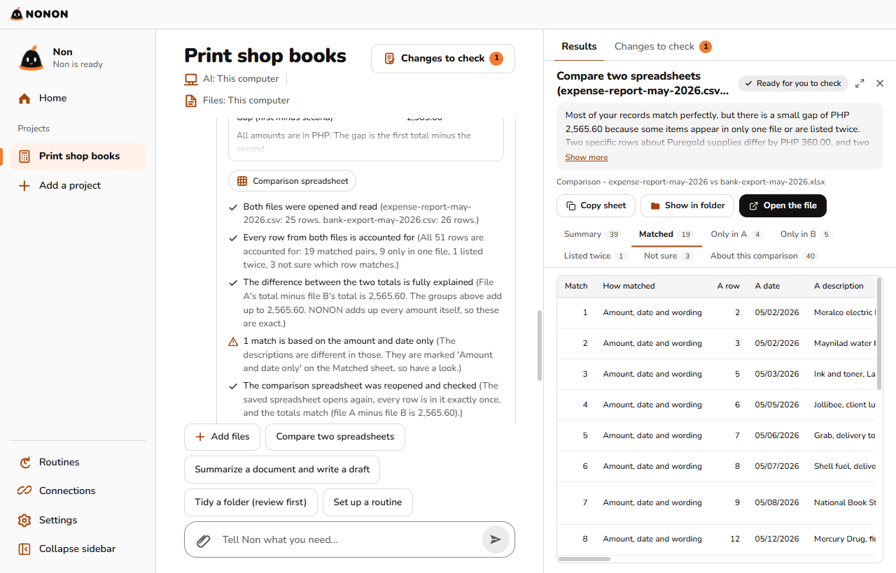
  <br><em>The Matched sheet: how each pair was matched (for example "Amount, date and wording").</em>
</p>

<p align="center">
  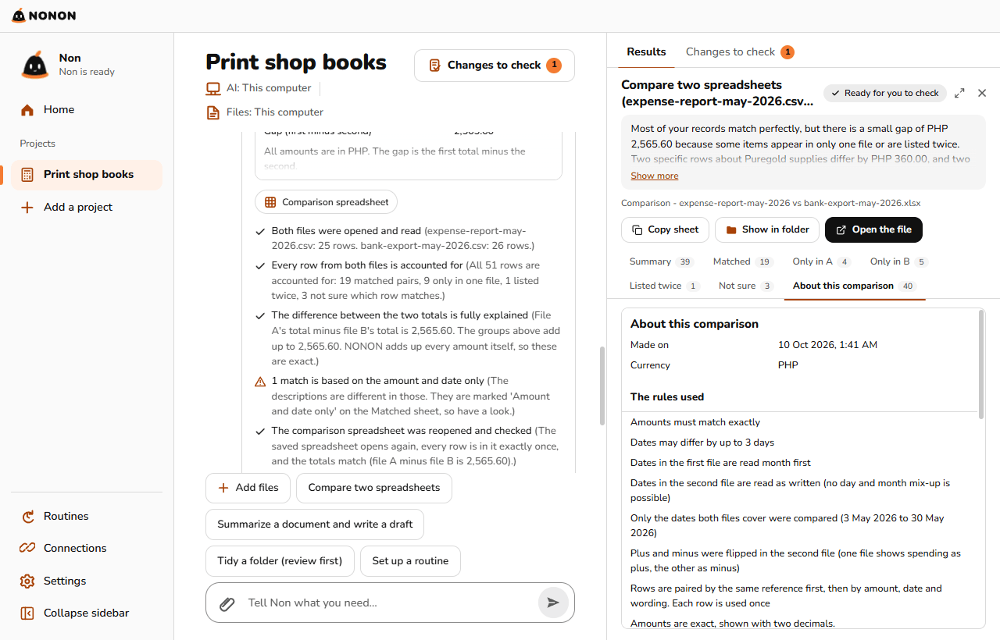
  <br><em>"About this comparison" spells out the rules in plain words so someone else can check the work.</em>
</p>

In the chat, the card also shows a preview and a list of check marks (and a warning where one applies). Expected for the sample pair: 51 rows, 19 matched pairs, 4 only in the expense report, 5 only in the bank export, 1 listed twice, 3 not sure, totals PHP 70,852.30 and PHP 68,286.70, difference PHP 2,565.60.

<p align="center">
  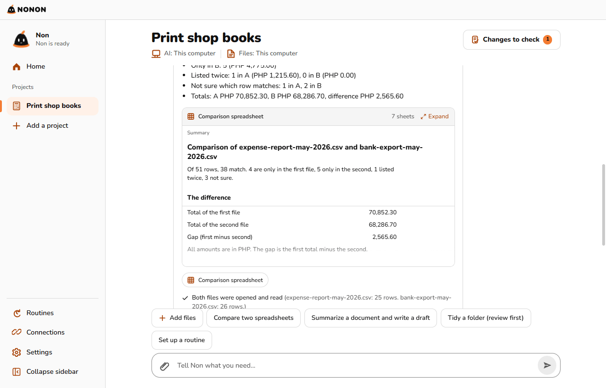
  <br><em>The chat card shows a preview. Expand opens the full viewer.</em>
</p>

### 6. Changes to check

NONON offers one change to your own file: add two columns to the expense report that say, row by row, whether each entry was found in the bank export. Nothing is changed yet. The panel shows the file as it would look after (and before), the new column headers **NONON status** and **NONON note**, and what was checked.

<p align="center">
  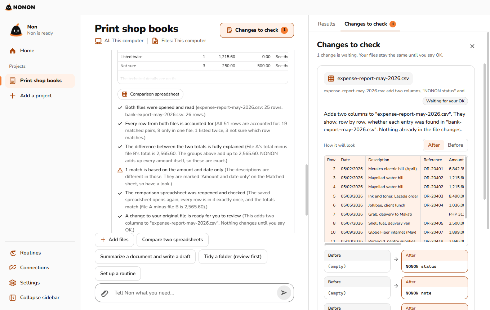
  <br><em>"Your files stay the same until you say OK." The preview shows exactly what would change.</em>
</p>

### 7. Make the change

Press **Make the change** at the bottom of the panel. NONON saves a backup copy first and then adds the two columns. Only two new columns are added at the end; nothing already in the file changes, and 25 of 25 rows get a status.

### 8. Undo

Press **Undo this change** (it asks once more: "Yes, undo it"). The file goes back to exactly how it was, byte for byte.

<p align="center">
  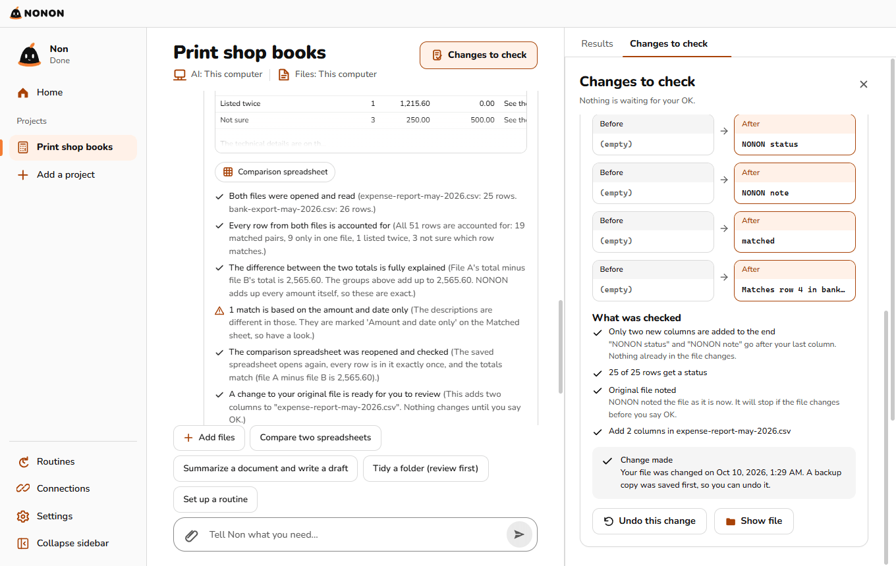
  <br><em>After the change: "A backup copy was saved first, so you can undo it."</em>
</p>

---

## What it can do today

Eight jobs are built. Each one was run on files with known answers (see [Testing and evidence](#testing-and-evidence)). The small local AI can word things loosely; the numbers, quotes and checks come from code and are shown next to the AI's words.

| Job | Who it is for | What you give it | What you get | Screenshot |
| --- | --- | --- | --- | --- |
| **Compare two spreadsheets** | Bookkeepers, shop owners, office staff | Two Excel or .csv files (the first sheet, or the one you choose) | A comparison workbook: Summary, Matched, Only in A, Only in B, Listed twice, Not sure, About this comparison. A short explanation and the first things to check. Optionally, a staged change to add two columns to the first file | [Results](#5-read-the-result-inside-the-app) |
| **Meeting follow-up** | Anyone who runs meetings | Meeting notes (.txt, .md, .docx or text PDF) | An editable Word file and a Markdown copy: action items (owner and date, with "Missing: owner" or "Missing: date" highlighted), decisions, open questions, a reply draft. Every item quotes the notes and the quote is checked | none (same result viewer) |
| **Study packet** | Students, teachers | One reading | Practice questions with answers, key ideas and a glossary. Every question carries a quote that must exist in the reading. Word and Markdown copies | none |
| **Lesson outline** | Teachers, trainers | One reading, and answers to a few questions (audience, length, objectives) | A lesson plan whose section minutes add up to the lesson length, each section citing lines of the reading | none |
| **Document draft** | Anyone | One document (.txt, .md, .docx, text PDF) | A short summary and a draft reply or report. Each part shows "Based on: file:line". Missing details become highlighted placeholders | [Home card](#2-pick-a-folder) |
| **Tidy a folder** | Anyone with a messy folder | Your project folder | A list of exact moves into `Sorted` folders by type (and year), with tidier names, and possible duplicates set apart. Nothing moves until you say OK, and moves can be undone | [Home card](#2-pick-a-folder) |
| **Team draft (project roles)** | People who use more than one AI | One source file and a goal | A plan, a draft and a review, each step done by the AI you chose for that role (the AI on this computer by default). Files: `Team draft.docx`, `Team draft.md`, and a spec-and-review file with a provenance table | [Home card](#2-pick-a-folder) |
| **Gmail brief** | Busy inboxes | Your own Gmail, read-only, after a one-time setup | A brief ranking mail by priority, with deadlines copied word for word from the email and reply drafts only for mail that needs attention. Labelled "Saved copy" when it is not a current check | [Connections](#connections) |

Limits that matter for each job:

- Spreadsheets: Excel numbers are read as shown in the cells, not recalculated from formulas. A workbook with charts, macros, pivots, external links or embedded objects can be compared but gets no staged change. Scanned PDFs are not read. XLSX support is the first sheet (or the chosen one), values only.
- Documents: scanned PDFs and images are refused, not read by OCR. Old `.doc` files are not supported. Text inside a document is treated as data: instructions hidden in a file are ignored and flagged.
- Gmail: only tried against a fake Google, see [Known limits](#known-limits-and-what-is-not-built).

<p align="center">
  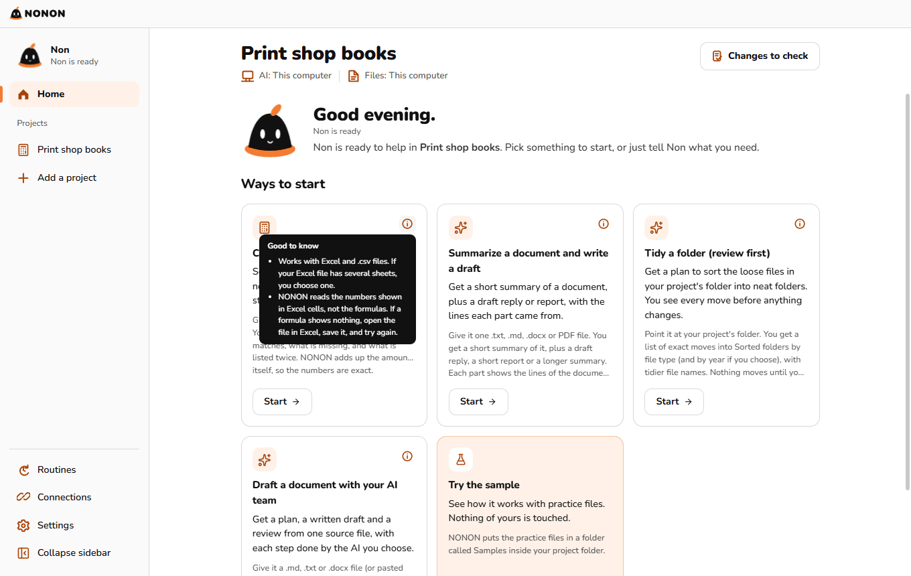
  <br><em>Each card says what it works with. "Good to know" lists the limits and what to do instead.</em>
</p>

---

## You stay in charge

This is the heart of NONON. The rules are enforced in code and covered by tests, not only written in a prompt.

**The approval model**

1. NONON works on its own copies and writes new files into `NONON Output`. It does not write to your originals while it works.
2. If a job would change one of your files (or move files), the change is **staged**: shown as "Changes to check" with before and after, and a list of what was checked.
3. Nothing happens until you press **Make the change**. A first backup copy is saved before any write.
4. **Undo this change** puts the file back.
5. An optional setting, "Make changes without asking, in projects I choose", exists. It is off by default, applies only inside the projects you pick, only when every check passed, never covers moving files, and always saves a backup first. Sending email, deleting files and running commands are never included, even in this mode.

<p align="center">
  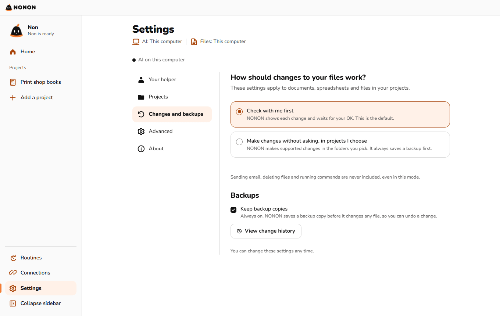
  <br><em>Settings, "Changes and backups". "Check with me first" is the default.</em>
</p>

**Guarantees that are tested** (40 tests on real files in [`changes.test.ts`](app/src/main/services/changes.test.ts), plus runs in the real app on Windows and Mac; evidence in [`changes-evidence.md`](docs/project/04-build-log/changes-evidence.md)):

| Guarantee | How it was checked |
| --- | --- |
| **The original is untouched before you say OK, and after you say no.** | SHA-256 of the file is equal after staging and after rejecting, for .csv and .xlsx. In the real app the original hash did not change while the panel was open. |
| **A stale file is refused.** If the file changed after the proposal was made, the change is not applied ("This file changed since the proposal was made"). | Test edits the file between stage and apply; nothing is written and no recovery copy is made. |
| **Undo is byte-identical.** | The restored file has the same hash as the original, on Windows and on Mac. |
| **Undo never overwrites newer edits.** If you edited the file after the change, undo refuses and tells you where the saved copy is. | Test edits after apply; the file stays as you left it. |
| **A partial failure is reported exactly.** | A test makes step 2 of 3 fail: "Only 1 of 3 steps were applied", which steps were not, and where the recovery copy is. |
| **Undoing a move also removes the folders the move created.** Moves only go back if the original path is still free and the moved file is unchanged. | Rename and move tests. |
| **New files never overwrite existing ones.** | Create-file test. |
| **Risky workbooks are refused with a reason**: charts, macros, pivots, external links, slicers, images, sheet protection. | One test for each. |
| **Writes are atomic and retried** if Windows says the file is open elsewhere; then NONON says it is open in another program and leaves the original alone. | Fault-injected test (a real file lock was not produced). |

Also: a job never leaves your project folder, files open only as documents (never programs or scripts), and a project set to "this computer only" never sends anything to an online AI, including from routines.

---

## Routines

A routine repeats a job for you on a schedule. You describe it in your own words, NONON turns it into a card for you to check, and nothing is saved until you say OK.

<p align="center">
  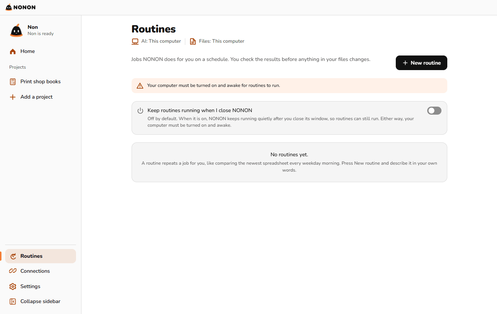
  <br><em>Routines. The warning is part of the product: the computer must be on and awake.</em>
</p>

<p align="center">
  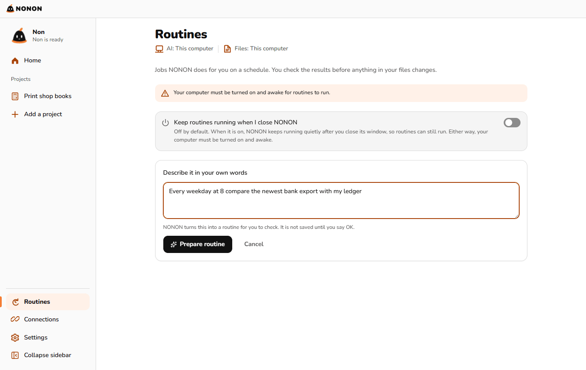
  <br><em>"Every weekday at 8 compare the newest bank export with my ledger", then Prepare routine.</em>
</p>

What was tested ([`scheduler-evidence.md`](docs/project/04-build-log/scheduler-evidence.md)): 89 tests with a fake clock (87 unit tests and 2 end-to-end tests with the real local AI), plus the real app: a plain-English request, confirm, run, answer a question once and remember it, and the next run unattended.

- Times follow your time zone, including daylight saving.
- It survives a restart. After days off it does **one** catch-up run, not one for every missed day.
- It never runs the same routine twice at once.
- It never approves changes for you. A routine can only read files, write into `NONON Output` and (for the Gmail brief) read mail.
- A sentence that asks it to send or delete does not widen what it may do.
- A routine whose online AI is not ready stops and says so. It does not quietly switch to another AI.
- A spreadsheet routine waits on its question until you answer it once.

Honest limits:

- **Your computer must be turned on and awake** for a routine to run. If the app is closed, a routine only runs if you turned on "Keep routines running when I close NONON" (off by default).
- Routines never send or delete anything.
- The tray icon and "start at login" were written but not seen working; hide-on-close was verified (window hidden, app still running).
- The Gmail routine and a routine that uses a real online AI were not run end to end.

---

## Connections

The Connections screen lists everything that can leave your computer. **Everything on it is off until you turn it on.**

<p align="center">
  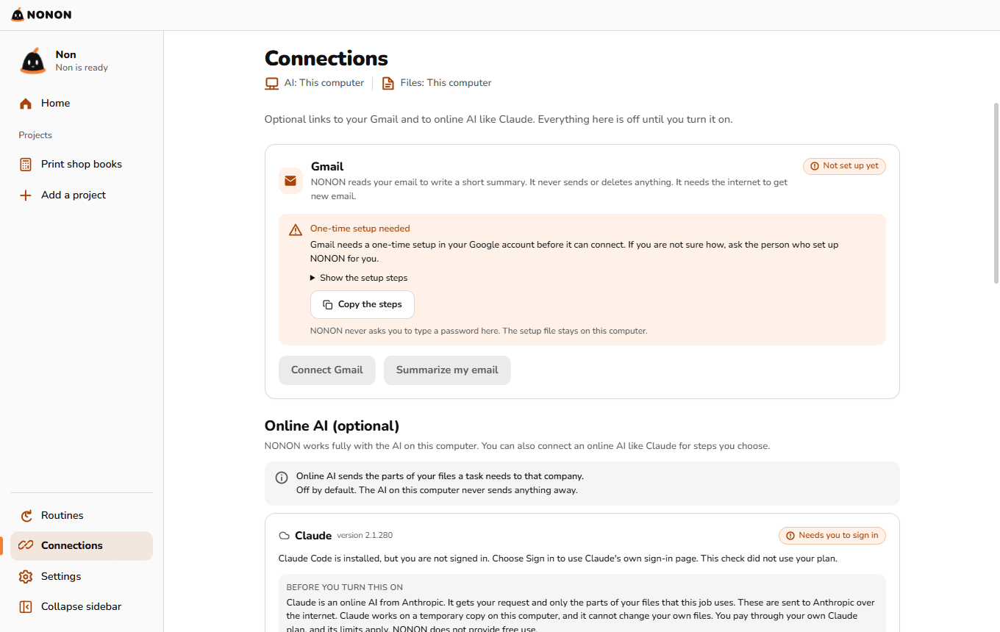
  <br><em>Connections: Gmail, and optional online AI. Online AI is off by default.</em>
</p>

<p align="center">
  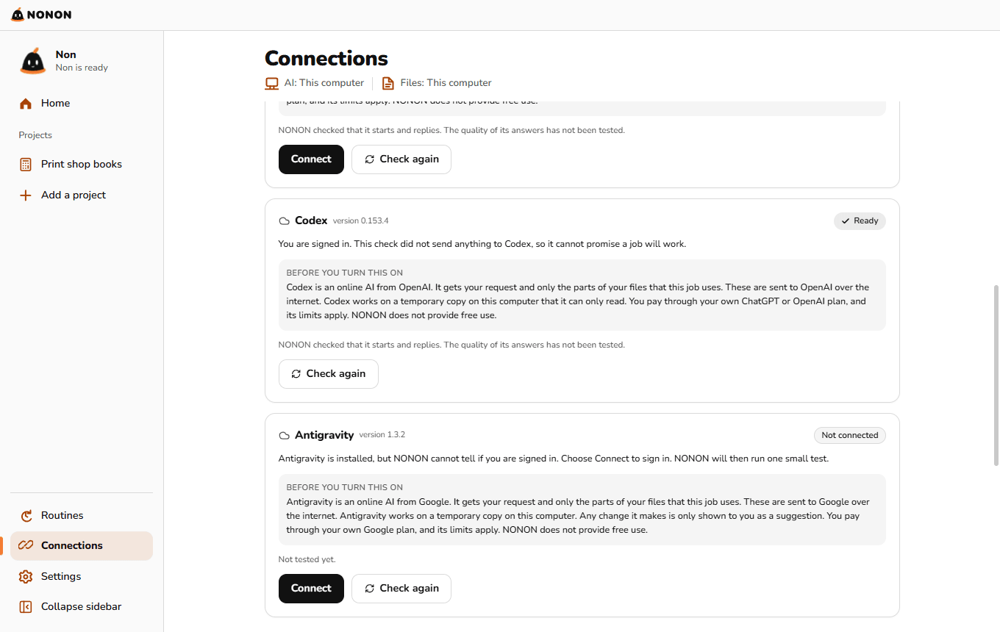
  <br><em>Each online AI explains who gets what before you turn it on, and that you pay through your own plan.</em>
</p>

| Connection | What it is | What is sent where | Status |
| --- | --- | --- | --- |
| **The AI on this computer** (default) | llama.cpp with Qwen3.5 4B or 9B | Nothing leaves your computer. Prompts go to a local server that listens on this computer only | Tested on Windows and Mac |
| **Claude** (optional) | Your own installed and signed-in Claude Code | The request and only the parts of your files that the job uses, to Anthropic, through the Claude program itself | Detected and handled. Not signed in on the test PC, so a real turn was **not run**; its turn, cancel and time-out are tested with mocks |
| **Codex** (optional) | Your own installed and signed-in Codex | Same idea, to OpenAI. Codex works on a temporary copy that it can only read | Real tiny turn, cancel, time-out and bad-folder tests passed |
| **Antigravity** (optional) | Your own installed Google Antigravity | Same idea, to Google. Anything it changes is shown only as a suggestion | Real tiny turn, cancel and time-out passed. Its exit code is not trusted |
| **Gmail** (optional) | Direct, read-only link to your own Gmail | Read requests to Google. The AI that reads the mail is the one on this computer | Tested against a **fake Google** only (see below) |
| **Share one computer's AI with another** (optional) | Your own computers on your own network | Prompts, which contain document text, go to your other computer over an encrypted link | Real pairing between a Windows PC and a MacBook passed |

**Online AI (Claude, Codex, Antigravity).** These are your own tools, installed and signed in by you. NONON does not bundle, modify or redistribute them, and does not collect or store their credentials. It does not use their sign-in pages in its own window; "Sign in" opens the vendor's own sign-in. A job runs on a throwaway copy of only the files it needs; a project can be set so it never uses online AI. If the connection fails, the step pauses and offers to use the AI on this computer. It does not switch by itself. Using them sends what the task needs to those companies, and they have their own prices.

**Gmail.** NONON reads Gmail directly from Google with read-only permission (`gmail.readonly`); it cannot send, draft, label, archive or delete. It does not use a connector service. Because NONON ships without a Google app of its own, you create a free "Desktop app" login once (about 10 minutes): see [`docs/gmail-setup.md`](docs/gmail-setup.md). While that app is in Google's Testing mode, sign-ins expire after 7 days. Saved mail is kept on your computer for 14 days (at most 200 messages) so a brief can be made offline; it is labelled with its age and is not a current check. Disconnect revokes the permission at Google and deletes the saved sign-in and mail. Running the AI on your computer does not make Gmail offline.

**Sharing your own computer's AI over the network.** Turn it on on the computer with the strong graphics card ("Share this computer's AI"). On the other computer paste a one-time pairing code (valid 5 minutes, works once). Both screens show the same six digits so you can check them, and the host asks "Allow this device?". Then a project can be set to "use my other computer". Details and limits: [`lan-evidence.md`](docs/project/04-build-log/lan-evidence.md). There is no screenshot of this card in the final look. It is off by default, only computers on private networks are allowed to connect, revoking a device cuts access at once, and if the other computer is off the task waits (and finishes after Resume) instead of silently using the local AI. Windows Firewall asks once the first time sharing starts: choose Private networks. Not tested: Wi-Fi roaming, the Windows Firewall first-run prompt, and a Mac as the client.

---

## Settings, Non and accessibility

<p align="center">
  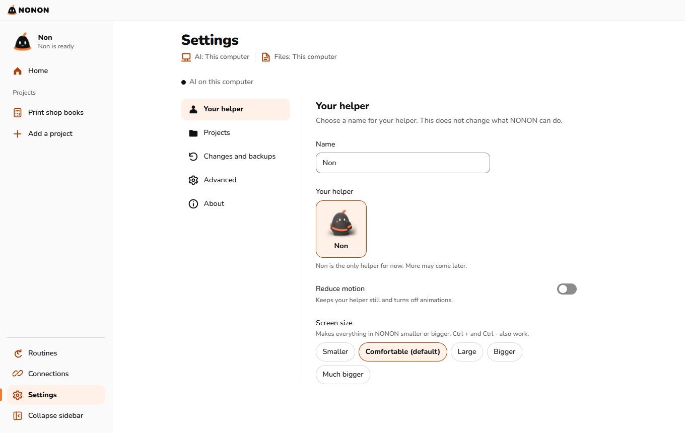
  <br><em>Settings: rename your helper, turn motion off, change the screen size.</em>
</p>

- **Screen size**: Smaller, Comfortable (default), Large, Bigger, Much bigger. Ctrl + and Ctrl - also work.
- **Reduce motion**: keeps Non still and turns every animation and transition off. It also follows your system's reduced-motion setting. The text status still says what happened.
- **Window and layout**: 397 of 397 layout measurement checks passed (margins, gutters, nothing wider than the window) at several window sizes and screen-size settings. The sidebar has a "Collapse sidebar" button for small windows.
- **Not verified**: a walk through the whole app with the keyboard only, and with a screen reader. Do not read this as an accessibility certification.

<p align="center">
  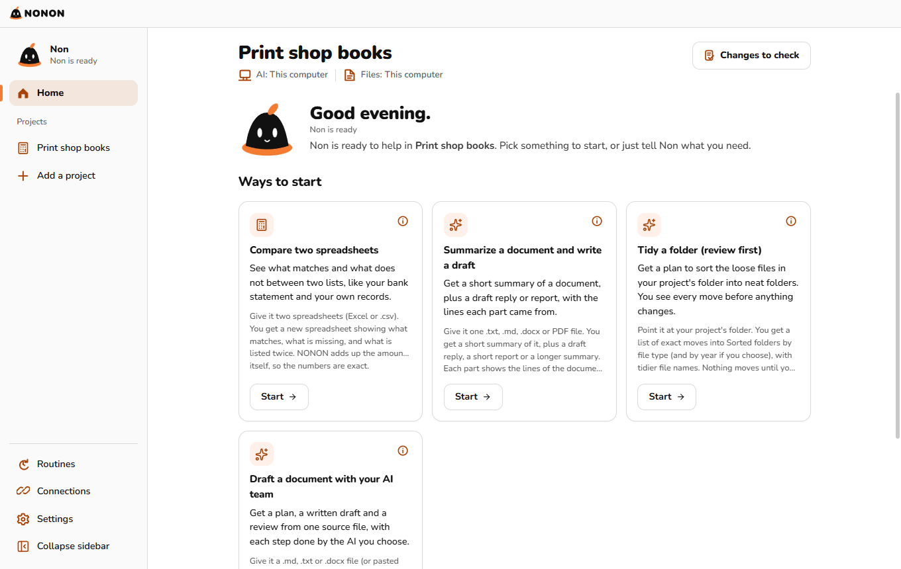
  <br><em>Reduced motion on: Non stays still.</em>
</p>

**Non and the six states.** Non is your helper. It has six small 2D motions that follow what the app is doing: idle, greeting, listening (while you type), thinking, talking (while a reply streams) and success. The status line under Non's name says the same in words ("Non is ready", "Non is listening", "Non is working on it", "Done"). There is one helper for now; you can rename it. The motion was measured: 26 transitions timed in the real window, worst 95th-percentile frame 5.1 ms with a graphics card and 14.9 ms with it turned off, none over 33 ms ([`motion-evidence.md`](docs/project/04-build-log/motion-evidence.md)).

<p align="center">
  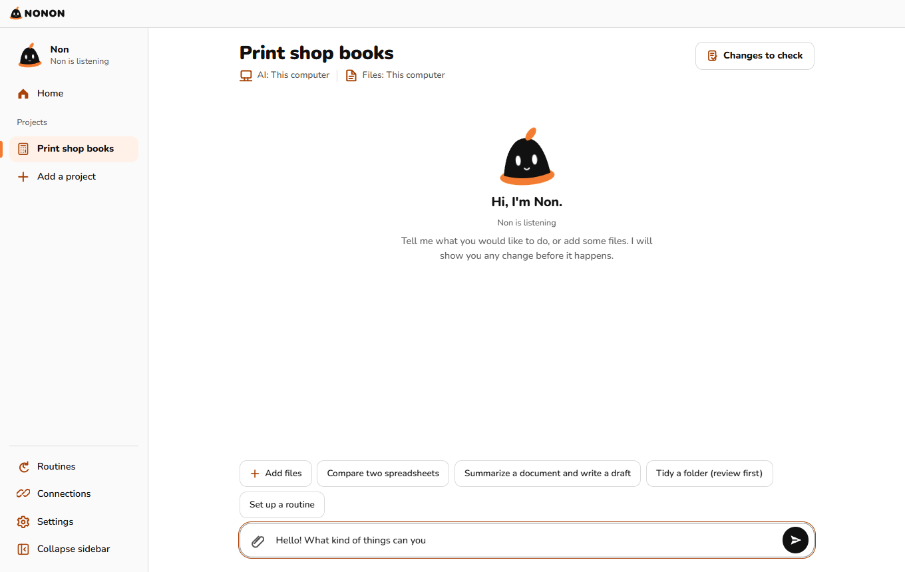
  <br><em>One of the six states: listening while you type.</em>
</p>

**Other settings.** "Projects" (name, kind of work, folder, remove a project: removing it only removes it from NONON, your files are not deleted), "Advanced" (the AI on this computer: status, memory used, stop it, run setup again, free memory when idle, check this computer), and "About".

<p align="center">
  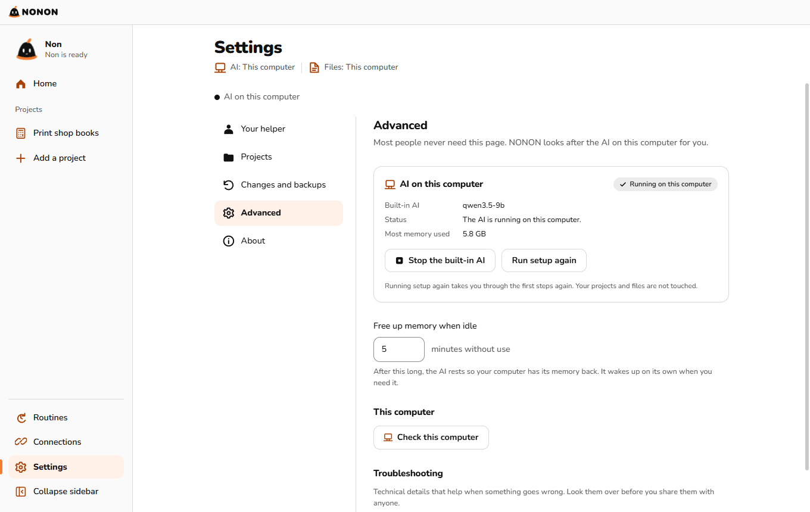
  <br><em>Advanced: stop the AI, run setup again, and choose when it rests to give your memory back.</em>
</p>

<p align="center">
  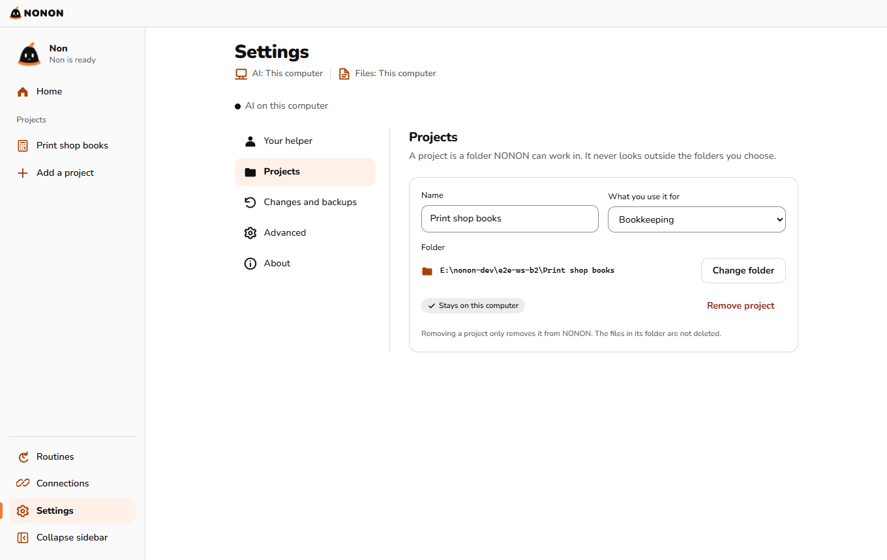
  <br><em>Projects: a project is a folder NONON can work in.</em>
</p>

<p align="center">
  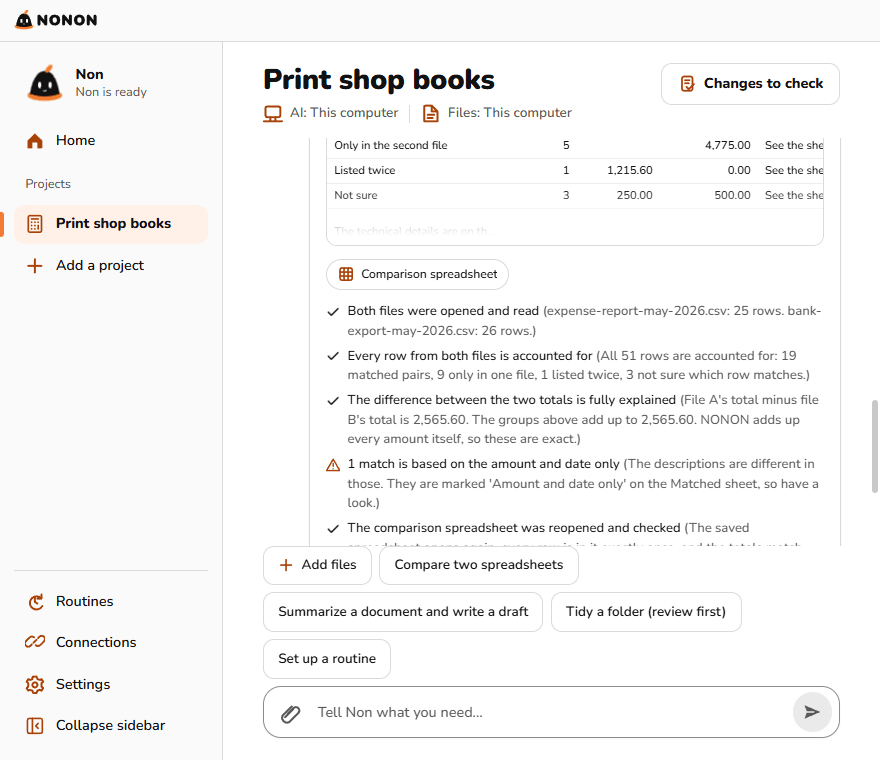
  <br><em>A narrow window still works (880 pixels wide shown).</em>
</p>

<p align="center">
  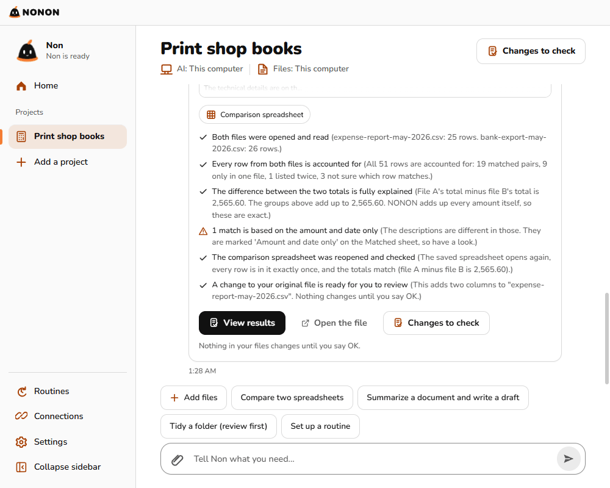
  <br><em>After a job: View results, Open the file (in Excel, Word and so on), and Changes to check.</em>
</p>

<p align="center">
  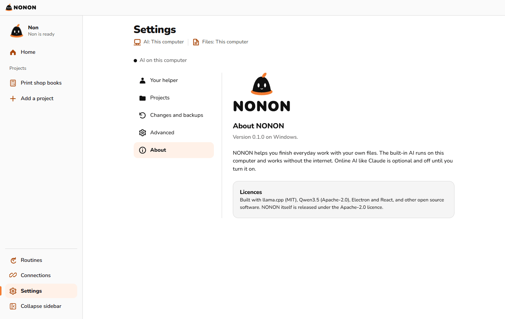
  <br><em>About: version and licences.</em>
</p>

---

## Install

You need Windows 10 or 11 (64-bit), or a Mac with Apple silicon (M1 or later). There is no phone, Linux or Intel Mac version. Aim for 8 GB of memory at least and 16 GB is better; these are targets we are testing, not promises (see [Resource use and hardware](#resource-use-and-hardware)).

Download from **https://trynonon.xyz/download**. The page shows the file name, size and a SHA-256 checksum so you can check the download.

<p align="center">
  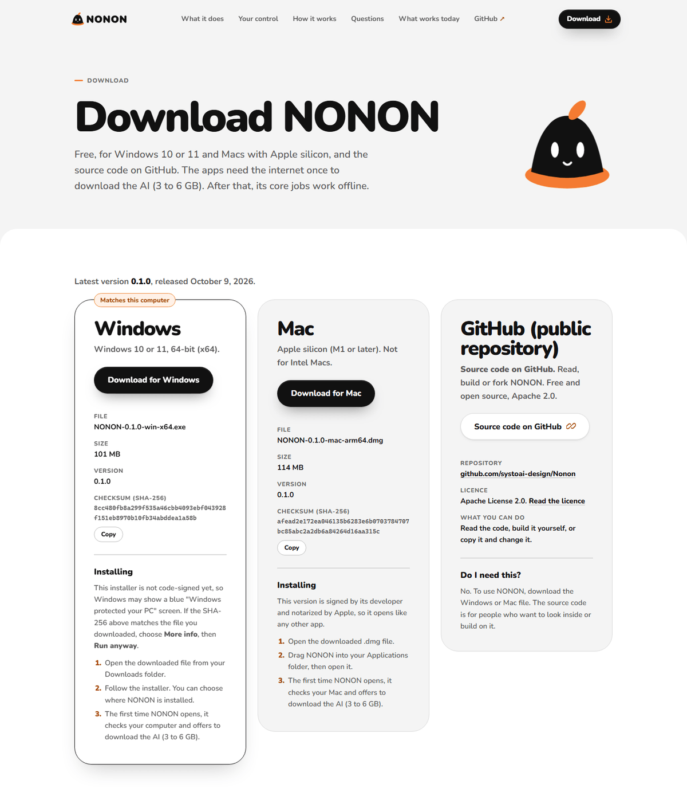
  <br><em>The download page (a real capture). The Windows and Mac cards carry their own install steps.</em>
</p>

### Windows (10 or 11, 64-bit)

1. Download `NONON-0.1.0-win-x64.exe` (about 106 MB).
2. **Windows SmartScreen note.** This installer is **not code-signed**, so Windows may show a blue "Windows protected your PC" screen with "unknown publisher". If the SHA-256 on the download page matches your file, choose **More info**, then **Run anyway**. A code-signing certificate (or the Microsoft Store) would remove this warning; NONON does not have one yet.
3. Follow the installer. You can choose where NONON is installed.
4. Open NONON. The first run checks your computer and offers to download the AI.

### Mac (Apple silicon)

1. Download `NONON-0.1.0-mac-arm64.dmg` (about 123 MB), open it and drag NONON into Applications.
2. **Gatekeeper note.** The Mac app is signed with the developer's own Developer ID and **notarized by Apple** (and stapled), so it opens like any other app. This was checked with Gatekeeper on the disk image downloaded from the live site with the browser quarantine flag set: "Notarized Developer ID" for the app and the disk image.
3. Open NONON from Applications.

<p align="center">
  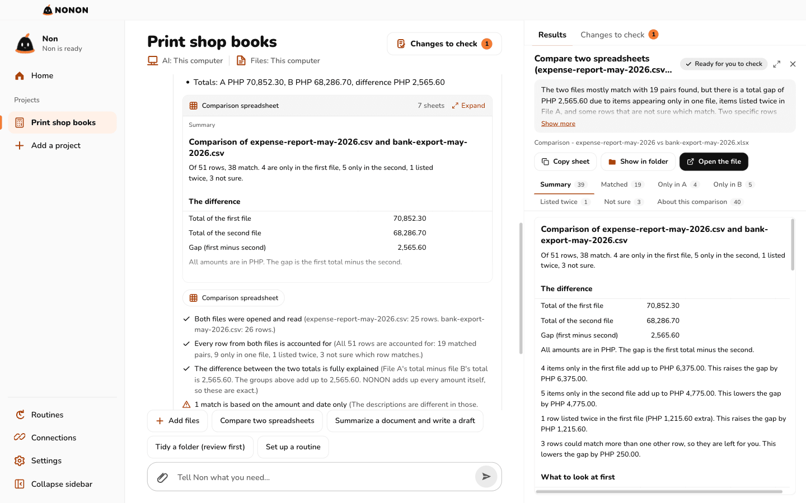
  <br><em>A real capture of the final signed and notarized Mac build (the disk image downloaded from the live site), after running the whole workflow on it. The picture is the page content: macOS blocked screen capture of the native window frame from the remote session.</em>
</p>

<p align="center">
  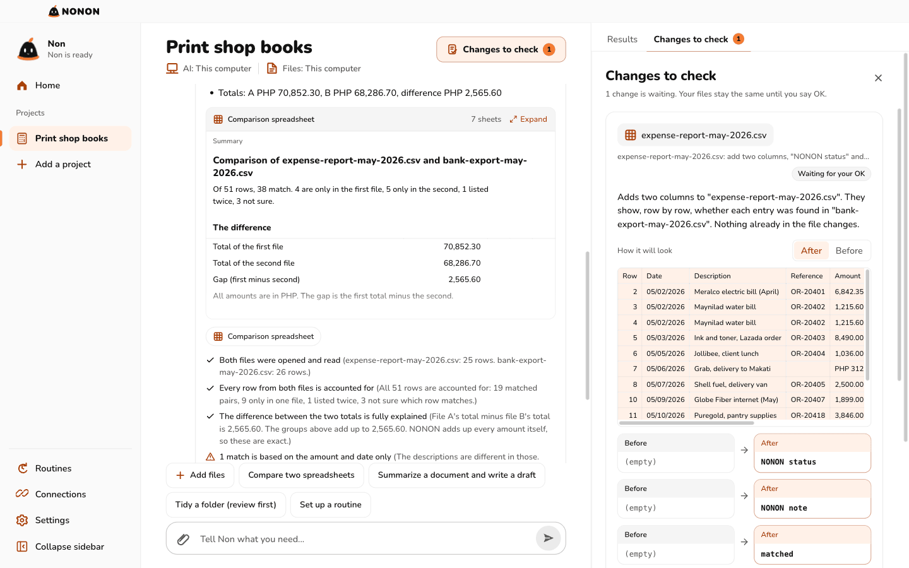
  <br><em>The same Mac build: the change is shown and waits for approval. Undo afterwards restored the file byte for byte.</em>
</p>

### First run: what is downloaded, and where things are stored

- **Skipped if you already have an AI:** a model found in LM Studio, Ollama, the Hugging Face cache or your Downloads folder is used in place (never copied, moved or changed). Details and measurements: [`docs/project/04-build-log/model-discovery-evidence.md`](docs/project/04-build-log/model-discovery-evidence.md).
- **One-time download:** the AI engine (llama.cpp, from GitHub) and a Qwen3.5 model (from Hugging Face), about **3 to 6 GB** in all. On the development PC the Qwen3.5 4B model with its engine took about a minute; the 9B model is 5.68 GB. Your time depends on your connection. Files are checked against a pinned size and SHA-256 before they are used. A cancelled download can be resumed.
- **After that**, the core jobs work offline. There is no offline installer: the first install needs the internet.
- **Where things are stored** (Electron's standard user folder; the Windows path is the one used on the test PC, the Mac path follows the same rule and was not looked at separately):

| What | Windows | Mac |
| --- | --- | --- |
| App settings, chats, routines, change history, backups | `%APPDATA%\NONON\data` | `~/Library/Application Support/NONON/data` |
| The AI engine and models | `%APPDATA%\NONON\models` | `~/Library/Application Support/NONON/models` |
| Everything NONON makes for you | a `NONON Output` folder inside each project folder | the same |

- **Move the models to another drive.** Set the environment variable `NONON_MODEL_DIR` to the new folder before starting NONON (`NONON_DATA_DIR` does the same for the data folder). On Windows you can also move the `models` folder and leave a directory junction at the old path; the development PC does this.
- **Uninstall.** Windows: Settings, Apps, NONON, Uninstall. Mac: drag NONON out of Applications. The installer is configured to **keep** your data and models, so delete the `NONON` folder shown above if you also want the several gigabytes back. Uninstalling was not exercised in testing. Your own project folders and `NONON Output` folders are never removed.

---

## How it works

NONON is an Electron app. The window (React) only shows things and asks the main process to do work. All work happens in services in the main process.

### Architecture

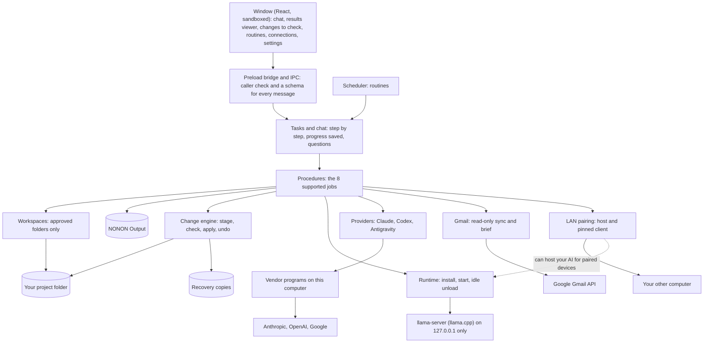
```mermaid
flowchart TB
  UI["Window (React, sandboxed): chat, results viewer, changes to check, routines, connections, settings"]
  IPC["Preload bridge and IPC: caller check and a schema for every message"]
  Tasks["Tasks and chat: step by step, progress saved, questions"]
  Sched["Scheduler: routines"]
  Proc["Procedures: the 8 supported jobs"]
  Work["Workspaces: approved folders only"]
  Chg["Change engine: stage, check, apply, undo"]
  Rt["Runtime: install, start, idle unload"]
  Prov["Providers: Claude, Codex, Antigravity"]
  Gm["Gmail: read-only sync and brief"]
  Lan["LAN pairing: host and pinned client"]
  Llama["llama-server (llama.cpp) on 127.0.0.1 only"]
  Files[("Your project folder")]
  NOut[("NONON Output")]
  Rec[("Recovery copies")]
  Vendor["Vendor programs on this computer"]
  Cloud["Anthropic, OpenAI, Google"]
  Google["Google Gmail API"]
  Other["Your other computer"]

  UI --> IPC --> Tasks
  Sched --> Tasks
  Tasks --> Proc
  Proc --> Work --> Files
  Proc --> NOut
  Proc --> Chg
  Chg --> Files
  Chg --> Rec
  Proc --> Rt --> Llama
  Proc --> Prov --> Vendor --> Cloud
  Proc --> Gm --> Google
  Proc --> Lan --> Other
  Lan -. "can host your AI for paired devices" .-> Rt
```

### Data flow of a comparison task

Code does the arithmetic, the model explains, checks verify, and changes are staged and wait for you.

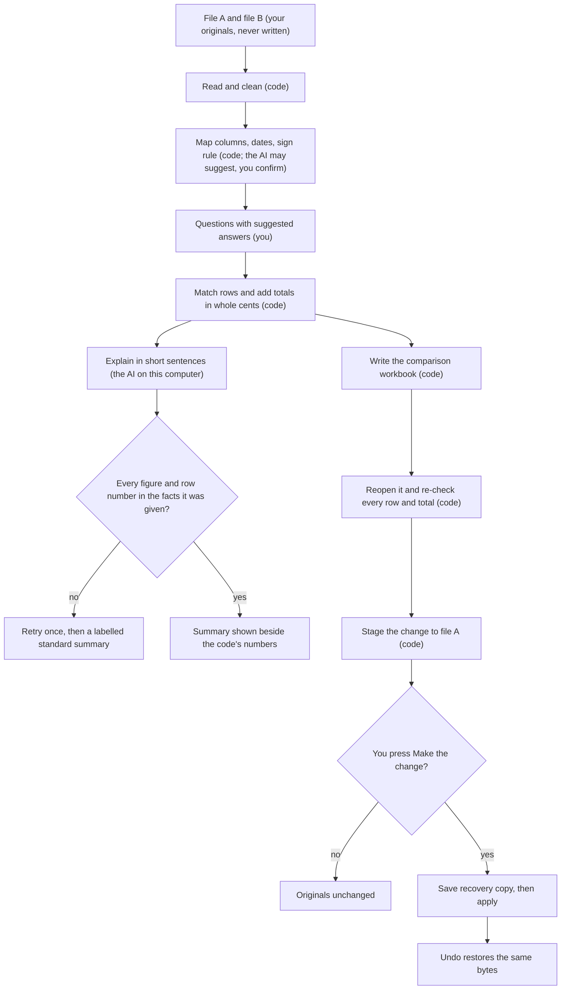
```mermaid
flowchart TB
  A["File A and file B (your originals, never written)"] --> R["Read and clean (code)"]
  R --> M["Map columns, dates, sign rule (code; the AI may suggest, you confirm)"]
  M --> Q["Questions with suggested answers (you)"]
  Q --> T["Match rows and add totals in whole cents (code)"]
  T --> W["Write the comparison workbook (code)"]
  W --> V["Reopen it and re-check every row and total (code)"]
  T --> E["Explain in short sentences (the AI on this computer)"]
  E --> G{"Every figure and row number in the facts it was given?"}
  G -- "no" --> F["Retry once, then a labelled standard summary"]
  G -- "yes" --> S["Summary shown beside the code's numbers"]
  V --> P["Stage the change to file A (code)"]
  P --> OK{"You press Make the change?"}
  OK -- "no" --> N["Originals unchanged"]
  OK -- "yes" --> B["Save recovery copy, then apply"]
  B --> U["Undo restores the same bytes"]
```

### The services, with source paths

| Service | What it does | Source |
| --- | --- | --- |
| Window and shell | Branded title strip, sandboxed window, CSP, blocked navigation and permissions | [`app/src/main/index.ts`](app/src/main/index.ts), [`hardening.ts`](app/src/main/hardening.ts), [`window-chrome.ts`](app/src/main/window-chrome.ts) |
| IPC | Every message is validated; the caller must be the app's own page | [`ipc.ts`](app/src/main/ipc.ts), [`ipc-schema.ts`](app/src/main/ipc-schema.ts), [`app/src/shared/`](app/src/shared) |
| Runtime (local AI) | Installs pinned llama.cpp and Qwen3.5 files, starts `llama-server` on a random loopback port with a per-run key, unloads when idle | [`services/runtime/`](app/src/main/services/runtime) |
| Hardware check | Reads memory, graphics card and disk to recommend 4B or 9B | [`services/hardware.ts`](app/src/main/services/hardware.ts) |
| Procedures | The eight jobs and the shared helpers (quote checking, number checks, Word and Markdown writers) | [`services/procedures/`](app/src/main/services/procedures) |
| Tasks and chat | Runs a job step by step, keeps progress on disk, asks questions, pauses when something is missing | [`services/tasks.ts`](app/src/main/services/tasks.ts), [`chat.ts`](app/src/main/services/chat.ts) |
| Workspaces | The approved folders. Everything is checked to be really inside one | [`services/workspaces.ts`](app/src/main/services/workspaces.ts), [`shell-guard.ts`](app/src/main/shell-guard.ts) |
| Change engine | Stage, check, apply with a recovery copy, undo. Supports csv, xlsx, new files, rename and move | [`services/changes.ts`](app/src/main/services/changes.ts), [`services/changes/`](app/src/main/services/changes) |
| Outputs | Safe previews of .csv, .xlsx, .docx, text and Markdown for the results viewer | [`services/outputs.ts`](app/src/main/services/outputs.ts) |
| Scheduler | Routines: parse plain English, cron in your time zone, catch-up, overlap lock, crash recovery | [`services/scheduler/`](app/src/main/services/scheduler), [`background.ts`](app/src/main/background.ts) |
| Providers | Drives the user's own Claude, Codex and Antigravity programs on a staged copy and turns what they write into suggestions. Also runs role stages | [`services/providers/`](app/src/main/services/providers) |
| Gmail | PKCE sign-in, read-only sync, 14-day cache, local brief | [`services/gmail/`](app/src/main/services/gmail), [`procedures/gmail-brief/`](app/src/main/services/procedures/gmail-brief) |
| LAN pairing | TLS host and pinned client, pairing codes, tokens, limits | [`services/lan/`](app/src/main/services/lan) |
| Window UI | Onboarding, chat, results, review, routines, connections, settings | [`app/src/renderer/src/`](app/src/renderer/src) |
| Website | Cloudflare Worker with the download page, `/api/latest` and `/dl/` | [`site/`](site) |

### Division of labour, in one sentence

The AI on this computer reads, interprets, asks and explains. Procedures (ordinary code) read files, add up money in whole cents, match rows, check quotes against the source, write the output files and decide what is safe. The model has no tools and cannot touch your files, and anything it writes is validated and re-tried once before NONON gives up and says so, instead of inventing something.

---

## Resource use and hardware

These numbers were measured by running the real code. They describe the test machines, not a promise for yours. **8 GB and 16 GB are engineering targets from the machines tested, not guaranteed minimums.** A real 8 GB computer was not tested.

Test PC (Windows 11): Intel i7-13700K, 64 GB memory, NVIDIA RTX 5070 with 12 GB. Engine llama.cpp b10909, Qwen3.5 Q4_K_M models, a 16K-token window, one request at a time ([`runtime-evidence.md`](docs/project/04-build-log/runtime-evidence.md)).

Test laptop (macOS 26.6): MacBook Pro (model Mac17,6) with an Apple M5 Max chip, 18 CPU cores (6 super and 12 performance), a 32-core GPU, 36 GB of unified memory and Metal 4. The same engine build for macOS on Apple silicon (llama.cpp b10909, Metal), the same Qwen3.5 4B Q4_K_M model, the same 16K-token window and one request at a time. The speed test below used the same 2,041-token prompt as on the PC.

| Run | Speed | Memory | Notes |
| --- | --- | --- | --- |
| Qwen3.5 4B, CUDA (graphics card) | about 139 tokens/s writing; first token 0.18 s after a 600-token prompt | 3.5 GiB peak | Start in 2 to 4 s. Idle unload gave the memory back |
| Qwen3.5 4B, Vulkan | about 131 tokens/s | 3.3 GiB peak | The first answer on Vulkan took 27 s once (one-time shader build) |
| Qwen3.5 9B, CUDA (the "recommended" size for 16 GB and up) | 89 to 91 tokens/s | 5.8 GiB peak | First token 0.26 s |
| Qwen3.5 4B, **no graphics card** (CPU only, 4 threads) | 55 tokens/s reading a 2,041-token prompt, 13 tokens/s writing | 4.45 GiB | A 46 s run. A comparison explanation would take roughly 20 to 30 s. The comparison itself (code) takes well under a second |
| Qwen3.5 4B on the MacBook (M5 Max, Metal) | 3,038 tokens/s reading the 2,041-token prompt; about 87 tokens/s writing (101 when the prompt was already cached) | 3.2 GiB in the speed test; 3.4 to 3.7 GiB peak seen inside the packaged app | The AI server was ready in about half a second with the model file already cached by macOS. The whole comparison took 3.1 s in the signed app. Same answers and the same undo hash as Windows |

What this does and does not show: the model loads and answers in under 5 GiB with no graphics card, so a 16 GB computer has headroom and an 8 GB computer is plausible. On an 8 GB computer with a slower processor, expect longer waits than shown. **Not tested:** a real 8 GB machine, paging, thermal throttling, other apps running alongside, AMD or Intel graphics, and Windows without the Visual C++ runtime. The app ships the runtime DLLs, but that fallback was not exercised.

Other measured facts: a 50,000-row against 49,000-row comparison took 9 seconds with a fake model (no memory problem seen); the AI stops after the idle time you set (and `llama-server` is gone after Stop and after quit).

---

## Privacy and security

Full inventory: [`network-inventory.md`](docs/project/04-build-log/network-inventory.md). Everything below was checked in code and by measurement on Windows.

**What can make a network request**

| Path | When | Where it goes | Offline |
| --- | --- | --- | --- |
| Engine and model download | You press install | `github.com/ggml-org/llama.cpp` and `huggingface.co/unsloth` only. No file or setting of yours is sent. Redirects off https are refused | Not needed after install |
| The local AI | While a job runs | `127.0.0.1` only (this computer) | Yes |
| Gmail | You connect, or ask for a brief, or a routine with permission comes due | `accounts.google.com`, `oauth2.googleapis.com`, `gmail.googleapis.com`; read-only | Brief falls back to saved mail, labelled |
| Online AI job | Only when a project allows it and you start that step | The vendor's own servers, through the vendor's own program | No |
| Sharing your computer's AI | Only after you turn it on | Your own computer on your private network | Yes, no internet needed |
| Links you click | You click | Your normal browser | No |
| Updates, telemetry, crash reports, fonts, CDN | Never | None. No update or analytics code. The font is bundled. The app never contacts the website | n/a |

**Measured: zero outside connections for local jobs.** Every TCP and UDP connection of the whole NONON process tree (Electron, graphics, renderer, `llama-server` and helpers) was sampled about every 0.5 seconds through start-up, a full spreadsheet comparison, idle and quit: **zero non-loopback connections**. The measurement found one real leak, which is now fixed: Chromium looked for a proxy script (a "wpad" name lookup and an IPv6 route probe) on every start. It is switched off, and a Chromium network log of a whole run now holds no DNS, socket or request events. With networking inside the main process forcibly refused, the job still completed.

This is not firewall-proof: there were no admin rights to add an operating-system block, short connections can be missed by sampling, macOS was not measured, and only the local core was exercised. First-time setup needs the internet once.

**Hardening that was done (all with tests)**

- Every IPC message is checked against a schema (ids limited to safe characters, paths and text length-capped, unknown keys dropped), and the caller must be the app's own page. This closed a hole where a crafted id could have read other `.json` files.
- Files open only as documents, and only inside your project folders (links and junctions are resolved first). Programs, scripts and shortcuts are refused.
- Sandboxed window, context isolation, no Node in the page, strict Content Security Policy, every non-local request cancelled, every permission denied except copying to the clipboard, navigation and redirects locked to the app's own page, links open only as plain https in your browser.
- Downloads are pinned by size and SHA-256 and refused if redirected off https; unpacking the engine archive is zip-slip proof (tested with real malicious entries).
- A link inside a project cannot lead a job into NONON's own data folder.
- Packaged app uses electron-builder fuses (`enableEmbeddedAsarIntegrityValidation`, `onlyLoadAppFromAsar`, `enableNodeOptionsEnvironmentVariable` off).
- Spreadsheet output cannot carry formulas from data. Model text is rendered as plain React nodes (no `innerHTML`, no links from model output). The local model has no tools.
- Connected AI programs run without a shell, with an allow-listed environment (API keys are not passed), on a throwaway copy, and a turn is stopped if it shows unexpected tools.
- Dependencies: `pnpm audit` found no high or critical issues (3 moderate in build and parsing libraries with low exposure). Secret scan of the working tree and history: no credential found ([`publication-readiness.md`](docs/project/04-build-log/publication-readiness.md)).

**Where tokens and secrets are stored**

- Gmail sign-in: encrypted with the operating system's protection (Electron `safeStorage`). If the system cannot encrypt it, NONON refuses to save it. No Google client id or secret is in the repository; you supply your own file.
- The paired computer's token: also in `safeStorage`; the host keeps only a salted hash of each device token.
- Claude, Codex and Antigravity sign-ins stay in each vendor's own store. NONON does not read, copy or keep them and never asks you to paste a secret.
- Secrets never go to the window, the logs or a command line.

**Open items, listed honestly** (from section 6.3 of the audit): the Claude and Codex read scope on your disk was not verified (reachable only when a project allows online AI); saved Gmail mail is plain JSON in the data folder (tokens are encrypted, the mail is not); the paired-computer host key file is not encrypted; document parsers run on untrusted files in the main process and a decompression bomb could stall the app; some Electron fuses were left at their defaults; Mac builds were not tested with the fuses.

---

## Testing and evidence

Full suite: `npx vitest run` from `app/` gives **716 passed, 33 skipped**. The 33 skipped are live tests that need a model, a program or an account and skip themselves when it is absent. Type checks (`tsc` for the main process and the window) are clean.

| Suite | Count | What it is |
| --- | --- | --- |
| Whole app | 716 passed, 33 skipped | Unit and integration tests |
| Changes (stage, check, apply, undo) | 40 | Real temp files, real exceljs, papaparse and jszip. One fault-injection test is labelled mocked |
| Spreadsheet comparison | about 100 | Fixtures with answers known by construction. The AI is **mocked** in these; a separate real-model run is documented |
| Document jobs (meeting, study, lesson, draft, tidy) | 104 in 8 files | About 95 deterministic or mocked (a fake model that makes classic small-model mistakes on purpose), 9 with the real local AI |
| Scheduler | 89 | 87 unit tests with a fake clock and 2 end-to-end tests with the real local AI |
| Gmail | 59 | 58 against a **fake Google**, 1 with the real local AI. Plus 14 real-model emails, 3 runs |
| Connected AI providers | 93 mocked, plus 14 live | Live tests (`NONON_LIVE=1`): 14 of 14 passed on the test PC for Codex and Antigravity; Claude was not signed in |
| Team draft (roles) | 43 mocked, plus real runs | Mocked stages; real runs: all three steps on this computer, and one run with Codex on the writing step |
| Sharing one computer's AI | 36 for the TLS server and pinning, plus task-layer tests | Real TLS host and client over loopback with a fake AI behind it, a real-model run, and a real pairing between two computers (below) |
| Security | IPC schema 9, shell guard 8, hardening 8, downloads, and more | Hostile-window probes against the dev and the packed build |
| Website | 31 download-path checks | Against the live site; Lighthouse 99 to 100 |
| Window | 26 transitions timed, 397 of 397 layout checks | Real Electron window |

**Verified in the real app**

- **Windows:** the installer was built, downloaded from trynonon.xyz, installed, and the full workflow was run on the packaged app (no developer tools needed). The same on the development build: comparison, meeting follow-up, study packet, big file, PDF and broken file, apply and undo.
- **Mac:** a packaged, signed and notarized app on a MacBook: install, answer, compare task. Undo gave the same hash as on Windows. The final branded build was checked with Gatekeeper only.
- **Sharing between two real computers:** a real pairing between a Windows PC and a MacBook over a home network. Approval on the Mac, a comparison ran on the Mac's AI with no AI process started on the PC, revoke cut access at once, and with the Mac off the task waited (no fallback) and finished after Resume.

**Mocked versus real**

- **Real:** the local AI (Qwen3.5 4B on Windows and Mac, 9B on Windows), file reading and writing, the change engine, spreadsheet output, the scheduler with a fake clock plus real app runs, Codex and Antigravity tiny turns, LAN pairing, the installers and the live site.
- **Mocked or only run against fakes:** Gmail (a fake Google), Claude (not signed in), Antigravity and Codex sign-in buttons (not run), a real Excel or Word opening the output, the tray icon and login item.
- Mocked tests are labelled as such in each file's header and in the evidence documents.

**Evidence documents** (all in [`docs/project/04-build-log/`](docs/project/04-build-log))

| Document | Covers |
| --- | --- |
| [`runtime-evidence.md`](docs/project/04-build-log/runtime-evidence.md) | Local AI install, speed, memory, CPU-only run, offline socket check |
| [`network-inventory.md`](docs/project/04-build-log/network-inventory.md) | Every network path, the measurement, the security review |
| [`publication-readiness.md`](docs/project/04-build-log/publication-readiness.md) | Secret scan, personal data, licences, dependency audit |
| [`spreadsheet-evidence.md`](docs/project/04-build-log/spreadsheet-evidence.md) | Spreadsheet comparison, known answers, real-model run |
| [`changes-evidence.md`](docs/project/04-build-log/changes-evidence.md) | Stage, apply and undo guarantees |
| [`documents-evidence.md`](docs/project/04-build-log/documents-evidence.md) | Meeting, study, lesson, draft and tidy jobs |
| [`roles-evidence.md`](docs/project/04-build-log/roles-evidence.md) | Team draft and project roles |
| [`scheduler-evidence.md`](docs/project/04-build-log/scheduler-evidence.md) | Routines |
| [`providers-evidence.md`](docs/project/04-build-log/providers-evidence.md) | Claude, Codex and Antigravity connections |
| [`gmail-evidence.md`](docs/project/04-build-log/gmail-evidence.md) | Gmail sync and brief |
| [`lan-evidence.md`](docs/project/04-build-log/lan-evidence.md) | Sharing one computer's AI |
| [`results-evidence.md`](docs/project/04-build-log/results-evidence.md) | Results shown inside the app |
| [`motion-evidence.md`](docs/project/04-build-log/motion-evidence.md) | Motion system and frame timings |
| [`brand-evidence.md`](docs/project/04-build-log/brand-evidence.md) | Branding, window frame and layout checks |
| [`margins-output.md`](docs/project/04-build-log/margins-output.md), [`margins-extreme-output.md`](docs/project/04-build-log/margins-extreme-output.md) | Raw layout measurements |
| [`copy-evidence.md`](docs/project/04-build-log/copy-evidence.md), [`copy-ui-evidence.md`](docs/project/04-build-log/copy-ui-evidence.md) | Plain-language wording ([`COPY-GUIDE.md`](docs/project/COPY-GUIDE.md)) |
| [`ui-shell-evidence.md`](docs/project/04-build-log/ui-shell-evidence.md), [`ui-review-evidence.md`](docs/project/04-build-log/ui-review-evidence.md) | App shell and review of the screens |
| [`site-evidence.md`](docs/project/04-build-log/site-evidence.md), [`site-brand-evidence.md`](docs/project/04-build-log/site-brand-evidence.md), [`site-redesign-evidence.md`](docs/project/04-build-log/site-redesign-evidence.md) | The website |
| [`submission-evidence.md`](docs/project/04-build-log/submission-evidence.md) | How the demo video was recorded |
| [`DELIVERY-LEDGER.md`](docs/project/DELIVERY-LEDGER.md) | The one-page status of everything |

Beginner users: no observation study was run, so there is **no claim that NONON beats anything**.

---

## Known limits and what is not built

Copied from the [delivery ledger](docs/project/DELIVERY-LEDGER.md).

**Implemented, but tested only with fakes or on one machine**

- **Gmail** (direct Google, read-only, local analysis, cached versus fresh): 59 tests against a fake Google, plus 14 real-model emails. **Not tried with a real Google account**: it needs the OAuth client file ([`docs/gmail-setup.md`](docs/gmail-setup.md)). Testing-mode Google sign-ins expire after 7 days.
- **Claude connection:** installed and detected, but not signed in on the test PC. Its turn, cancel and time-out are mocked.
- **Antigravity and Codex sign-in buttons:** the launch paths exist; they were not run (they open the vendor's own sign-in).
- **Tray icon, start at login, hide-on-close:** hide-on-close verified (window hidden, process alive). The tray icon and login item were not seen.
- **Word output:** the `.docx` files were re-read by code only; never opened in Word.
- **Mac native window frame (traffic lights):** the final signed Mac build ran the full workflow, but macOS blocked screen capture of the native window frame from the remote session, so the frame itself was not photographed. The page leaves room for the traffic lights.

**Not built or deliberately out**

Phone app; Linux; Intel Macs (the local AI needs Apple silicon); scanned PDFs; other characters (only Non); unrestricted screen control; a broad app catalogue; Composio (excluded by decision); automatic updates; model training; an offline installer (first run downloads 3 to 6 GB, then the core jobs work offline); the profession packs' reviewed reference library with local search (packs have jobs, samples and templates, not a reference library).

**Honest limits to say out loud**

- Small local model: explanations can be loose. The numbers in results come from code, shown beside the AI's words.
- 8 GB and 16 GB are engineering targets from the machines tested, not guarantees.
- The Windows installer is not code-signed, so SmartScreen shows "unknown publisher".
- No beginner observation study was run, so no claim that NONON beats anything.
- Local AI means the thinking happens on the computer. Gmail, Claude, Codex and Antigravity are online services; using them sends what the task needs to those companies.
- Routines need the computer to be on and awake.
- Sharing between computers was not tested over Wi-Fi roaming, with the Windows Firewall first-run prompt, or with a Mac as the client.

---

## Run from source and package

Requirements: Node 22 or newer and pnpm.

```
cd app
pnpm install
pnpm dev            # Electron with hot reload
pnpm test           # vitest; live tests skip unless a local model, a program or an account is present
pnpm typecheck      # tsc for the main process and the window
pnpm build          # production bundle
pnpm package:win    # NSIS installer into app/release (run on Windows)
pnpm package:mac    # dmg and zip (run on a Mac)
pnpm dev:web        # the window in a browser with demo data (no real AI)
```

Environment variables that help in development:

| Variable | Use |
| --- | --- |
| `NONON_DATA_DIR`, `NONON_MODEL_DIR` | Put the data and the AI files on another drive |
| `NONON_RUNTIME=vulkan` | Force the Vulkan engine instead of CUDA |
| `NONON_LIVE=1` | Run the live provider tests against the vendor programs you have installed |
| `NONON_GOOGLE_CLIENT_ID`, `NONON_GOOGLE_CLIENT_SECRET` | An alternative to the `google-client.json` file for Gmail ([setup](docs/gmail-setup.md)) |

**Signed and notarized Mac build, in general terms.** `scripts/mac/` holds the shell scripts that run on the Mac: one to build and sign, one to notarize, and one to copy the working tree to a Mac over SSH. They read everything that is specific to a person or a machine (the Mac's address and key, the signing identity, the notary credentials and the keychain password) from a local environment file and from files that sit outside the repository, and they refuse to run without them. Nothing identifying is meant to be committed. You need your own Apple Developer ID and your own notary credentials. Windows builds are unsigned unless you add a certificate in `electron-builder.yml`.

**The website** (Cloudflare Worker and R2 for downloads) is in `site/`. Build the pages with `node scripts/build-pages.mjs` and run it locally with `npx wrangler dev`. The release and deploy runbook is [`site/DEPLOY.md`](site/DEPLOY.md). Publishing a release or deploying the site is a manual step by the owner.

---

## Repository layout

```
.
├── app/                      Electron app (TypeScript)
│   ├── src/main/             Main process: window, IPC, hardening, services
│   │   └── services/         runtime, procedures, tasks, changes, scheduler,
│   │                         providers, gmail, lan, outputs, workspaces
│   ├── src/preload/          The bridge exposed to the window
│   ├── src/renderer/         The React window (onboarding, chat, results, review, ...)
│   ├── src/shared/           Contracts and IPC channel names shared by both sides
│   ├── resources/samples/    Sample files that ship with the app
│   └── electron-builder.yml  Packaging, fuses, signing options
├── site/                     trynonon.xyz: pages, scripts, Cloudflare Worker
├── fixtures/                 Evaluation inputs with known answers
│                             (spreadsheet, documents, gmail, team-draft)
├── scripts/                  Dev helpers and scripts/mac/ (build, sign, notarize on a Mac)
├── docs/
│   ├── gmail-setup.md        One-time Gmail setup guide
│   ├── readme/               Images used by this README and the link checker
│   ├── project/              Status, ledger, copy guide, evidence in 04-build-log/,
│   │                         real screenshots, reuse inventory
│   └── reference/            Product plan and handover
├── LICENSE                   Apache-2.0
└── NOTICE                    Credits and third-party licences
```

---

## Contributing and feedback

- Questions, bugs and ideas: open an issue at https://github.com/systoai-design/Nonon/issues. Please say your system (Windows or Mac), your memory size, and what you were doing.
- Pull requests are welcome. Before you open one: run `pnpm typecheck` and `pnpm test` in `app/`, keep wording plain (follow [`docs/project/COPY-GUIDE.md`](docs/project/COPY-GUIDE.md)), label any test that uses a fake as mocked, and list reused code in [`docs/project/reuse-inventory.md`](docs/project/reuse-inventory.md).
- Rules the project keeps: originals are never written before approval and every change makes a recovery copy first; a project set to this-computer-only never uses an online AI, including from routines; secrets never reach the window, the logs or a command line; code does the arithmetic and the model explains.
- To check this README's links and images: `node docs/readme/check-readme.mjs`.

---

## Credits and licences

NONON is released under the **Apache License 2.0** ([`LICENSE`](LICENSE)). Copyright 2026 Kyle Cabahug. See [`NOTICE`](NOTICE) and [`docs/project/reuse-inventory.md`](docs/project/reuse-inventory.md).

- **Pragma** by Systo AI (https://www.trypragma.xyz), Apache-2.0, itself derived from **OpenMausBot** (Apache-2.0). NONON adapted from Pragma: the pinned llama.cpp and Qwen3.5 references and checksums, the way the Claude, Codex and Antigravity programs are driven, and the website's design system and GSAP motion architecture. Everything else was built during this hackathon.
- **Non** is the Pragma mascot Pip, used with permission of its owner. The logo, icons and the animated face come from the NONON brand pack.
- **llama.cpp** (MIT, the ggml authors): the engine, downloaded on first use and not modified.
- **Qwen3.5** models by Alibaba Cloud's Qwen team (Apache-2.0), GGUF conversions by Unsloth: downloaded on first use and not modified.
- **Nunito** typeface (SIL Open Font License 1.1).
- **GSAP** for the website's motion (self-hosted and unmodified; credited on the site's licences page).
- **Electron**, **React**, **Vite**, **Tailwind CSS**, **ExcelJS**, **Papa Parse**, **docx**, **mammoth**, **unpdf** (with Mozilla PDF.js), **Croner**, **JSZip**, **zod**, **lucide-react**, **selfsigned** and others, each under its own licence listed in [`NOTICE`](NOTICE).
- **Claude, Codex and Antigravity** are optional connections to your own installed and signed-in tools from Anthropic, OpenAI and Google. NONON does not bundle, modify or redistribute them. Gmail is Google's service. **NONON is not affiliated with or endorsed by their makers.**

**AI coding tools disclosure.** Claude (by Anthropic) wrote most of the code under the developer's direction. Local AI models in the product are Qwen3.5. Mocked tests, real runs and unverified items are labelled throughout this repository.
